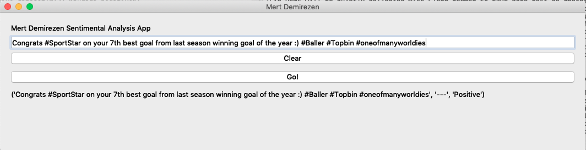

#  Twitter Sentimental Analysis
## Graduate Project

The program is written entirely in python (version 3) and utilizes components of the Natural Language Toolkit

The result is a label which in this case can be 'positive' or 'negative'.
Detecting English Language

This is implementation of the **NLP** and **MachineLearning**

On this project Classifier model  by utilizing the nltk.NaiveBayesClassifier.train function 

## Image Of Project



## Example Usage

On the blank enter your tweet or text etc. then Click 'Go!'

## Install

**Terminal **

```
Clone the files
git clone https://github.com/demirezenmert/Python.git
python3 Python/Password\ Generator/

Enter key for generate Password and lenght Min - Max seperated by comma (,)
```


## TURKISH INFORMATION

# Twitter Duygu Analizi 

Algoritma Python (versiyon 3) ile yazılmıştır. 

Nlt(Natural Language Toolkit) araçları kullanılmıştır.

Algotritma dönüş cevabı olarak **Positive(Olumlu)-Negative(Olumsuz)** Döndürmektedir...

İngilizce Metinler Üzerinde Çalışmaktadır!

Makine öğreniminin ve Nlp projesidir.

## Kullanım

Program üzerindeki boşluğa tweetlerinizi veya metinlerinizi girin, "Go!" tuşuna basınız.
